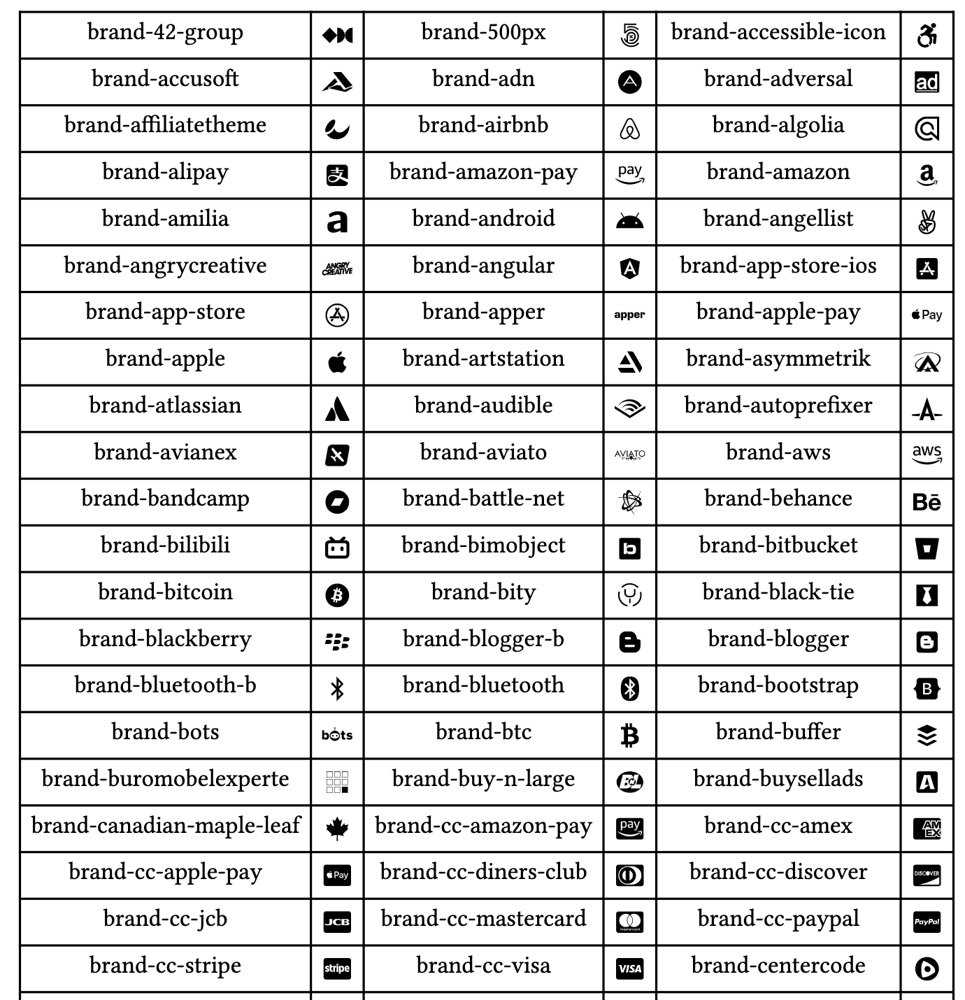

# Typst-FontAwesome

[FontAwesome](https://fontawesome.com/) binding for [Typst](https://typst.app/docs/).

## Usage

1. Download the `fontawesome.typ` file
2. Import it into your Typst file like the following example

```typst
#import "fontawesome": *
```

3. Use it with in camelCase pattern like `#box(faPhone)`



Checkup [manual](https://github.com/ivaquero/typst-fontawesome/blob/main/manual.pdf) for more details.

## Changelog

- v0.0.1 (2023-07-27)
  - Initial release
  - add fontawesome v6.4.0
